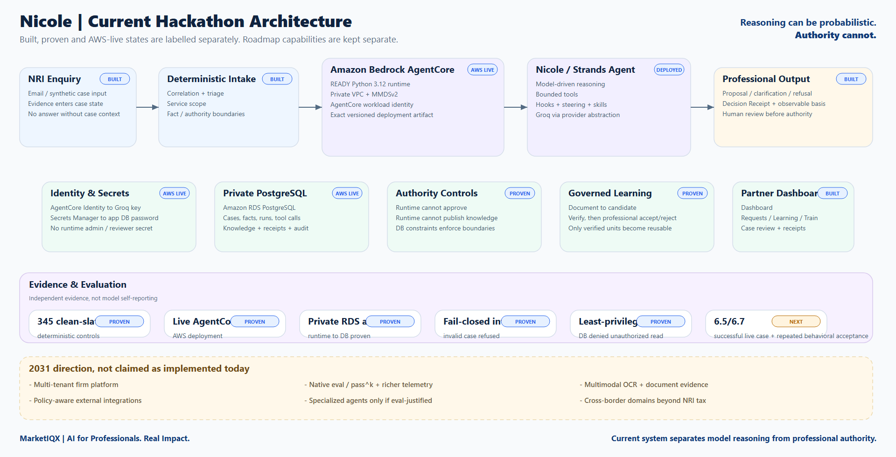
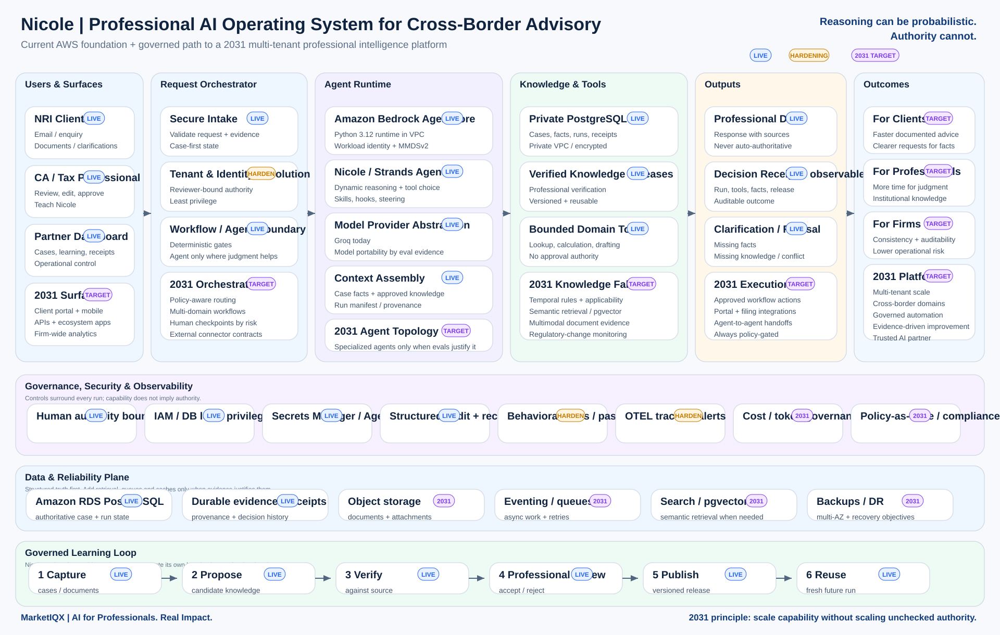

# Nicole - Governed Professional Agent for Cross-Border Tax Advisory

**Reasoning can be probabilistic. Authority cannot.**

Nicole is a governed learning agent for professional-services firms handling NRI and cross-border tax/compliance work. It takes a case from intake through evidence retrieval, model-driven reasoning, bounded tool use and a reviewable recommendation, while keeping professional authority with the human professional.

Built for the **AWS Agents for Humans Hackathon** with **Strands Agents** and deployed on **Amazon Bedrock AgentCore Runtime**.

Nicole is not a tax chatbot. The product question is harder:

> Can an AI agent do the repetitive work of a professional firm without quietly acquiring the authority of the professional?

The architecture answers that by separating model reasoning from authority, verification, publication and execution.

## Who it is for

The primary user is a Chartered Accountant, tax professional or small professional-services firm serving NRIs and other cross-border clients. The repetitive questions are familiar - residency, filing, remittances, account status, FEMA and supporting evidence - but a correct answer depends on facts about the individual, effective dates, source quality and professional judgment.

Nicole reduces repeated reconstruction without turning fluent model output into professional truth.
## What Nicole does

1. Persists an inbound enquiry and correlates it conservatively to a case.
2. Requires service scope before reasoning begins; ambiguous routing waits for a person.
3. Builds bounded case context and retrieves only governed knowledge available to the runtime.
4. Lets the Strands agent reason and choose among four bounded tools.
5. Records proposed facts as proposals, never confirmations.
6. Validates what may be claimed against deterministic evidence and applicability rules.
7. Produces a professional-review surface with the client message, proposed response, tool trajectory and decision receipt.
8. Keeps approval, verified-knowledge publication and consequential execution outside the model's authority.
9. Learns through a governed loop: extract candidate knowledge, verify it against the source, let a professional accept or reject it, then make only accepted knowledge reusable.

The current runtime tool surface is intentionally small:

```text
get_case_context()
get_service_knowledge(query, service_id)
record_proposed_facts(facts, evidence_refs)
propose_next_action(action)
```

There is no generic shell, generic HTTP tool, approval tool, knowledge-publication tool or send tool inside the agent.
## Architecture

### Live hackathon implementation



The live deployment separates five concerns:

- **Inference:** Strands agent reasoning with a provider abstraction. The current AgentCore deployment uses Groq-hosted `openai/gpt-oss-120b`; the repository also retains an AWS Bedrock model adapter for local/provider portability.
- **Execution:** Amazon Bedrock AgentCore Runtime, Python 3.12, VPC mode, MMDSv2 enabled.
- **Identity and secrets:** AgentCore Identity supplies the Groq API-key credential; AWS Secrets Manager supplies the PostgreSQL application password at runtime. Secrets are not embedded in the deployment environment or repository.
- **Authority:** bounded tools plus PostgreSQL privileges and constraints prevent the runtime from confirming facts, publishing knowledge, approving its own work or expanding its own service scope.
- **Professional control:** the Nicole Partner Dashboard surfaces cases, requests, learning candidates, verified knowledge, recent runs, review actions and decision evidence.

The deployed PostgreSQL database is private and encrypted. Its security group accepts PostgreSQL traffic only from the AgentCore runtime security group. The runtime executes in private subnets with outbound internet access through NAT for the configured model provider.

### 2031 target architecture



The 2031 diagram is a product thesis, not a claim that every box exists today. It separates roadmap capabilities such as richer multi-tenant orchestration, advanced memory, broader integrations, stronger observability, native evaluation infrastructure, multimodal/OCR pipelines and additional professional domains from the live hackathon implementation.
## Live AWS deployment evidence

The current deployment is not a diagram-only architecture. The following has been verified against the AWS account used for the hackathon:

- AgentCore Runtime `NicoleProfessionalAgent` is `READY` in `us-east-1`.
- Runtime code is deployed from an immutable, versioned S3 object using Python 3.12.
- The exact deployment ZIP was rebuilt for ARM64, scanned for credential-pattern hits, imported successfully on an ARM64/Python 3.12 environment, uploaded, downloaded by exact S3 VersionId and SHA-256 matched byte-for-byte.
- The runtime execution role is scoped to the required AgentCore logging/telemetry and the Nicole application database secret; it does not carry AdministratorAccess, RDS administration or reviewer/admin database secrets.
- AgentCore Identity provider `NicoleGroq` exists separately from the runtime execution role.
- The runtime is attached to two private subnets and has live ENIs in both.
- Amazon RDS PostgreSQL is non-public and storage-encrypted.
- The RDS security group permits port 5432 from the runtime security group, not from an internet CIDR.
- Runtime command execution proved that code inside the actual AgentCore microVM can resolve the application database secret and authenticate to the private RDS as `agents_app`.
- The same runtime database identity was refused when it attempted to read privileged schema-administration state, demonstrating that deployment did not collapse the database authority boundary.
- A live AgentCore invocation against a nonexistent case returned `RUN_REFUSED` rather than fabricating context.

`READY` is deliberately not treated as proof that an NRI case completed end to end. Control-plane health, credential resolution, database reachability and agent behavior are separate claims and are tested separately.
## Governed learning, not autonomous self-authorisation

Nicole can evolve, but she cannot promote her own output into institutional truth.

The current training path supports `.pdf`, `.docx`, `.txt` and `.md` documents. Text is extracted into candidate knowledge; a second verification step checks the candidate against the captured source; the professional sees the proposed statement and its evidence; the professional then accepts or rejects it. Accepted material is published as professionally verified knowledge and may be retrieved by a fresh agent session. Rejected material is not reusable.

Scanned-image PDFs are **not** silently treated as readable. The extractor refuses them when no readable text is present and states that an OCR layer must run first. OCR is roadmap work, not a current capability.

The verification ladder is explicit:

```text
UNVERIFIED
SOURCE_RECORDED
SOURCE_VERIFIED
PROFESSIONALLY_VERIFIED
```

Only the top rung may support a client-facing answer. The software records represented professional authority; it does not independently verify a professional credential against an external register.

This is why the product is described as a **governed learning professional agent**, not a self-training autonomous tax adviser.
## Why a proposal is not authority

Nicole is allowed to reason probabilistically. She is not allowed to enlarge her own authority.

The governing boundary is enforced outside the prompt:

- case and service scope are bound server-side before the model runs;
- agent facts default to `PROPOSED` and the runtime cannot confirm them;
- the runtime cannot publish or activate knowledge releases;
- a supported proposal must cite admissible evidence and the release relied upon;
- proposal revisions are append-only;
- approval binds exact content by digest and dispatch rechecks the digest;
- runtime and reviewer database roles have different grants;
- neither serving role has general destructive authority over the audit record.

A decision receipt is derived from authoritative rows: run identity, tool calls, proposal state, facts, knowledge release, cited units and context evidence. It intentionally does **not** store private chain-of-thought. The auditable basis is observable state and tool trajectory, not unverifiable internal monologue.

A future correction-receipt contract is documented, but it is not presented as implemented.

## Partner Dashboard

The local Nicole Partner Dashboard is a professional work surface rather than a chat window. It currently exposes:

```text
Dashboard | Requests | Knowledge | Learning | Train Nicole
```

The dashboard shows `Cases`, `Needs review`, `Learning candidates`, `Verified knowledge` and `Recent agent runs` from database state. Case views expose the client enquiry, Nicole's proposed outcome, review actions, decision evidence and tool trajectory.

The console currently uses a server-bound acting reviewer and explicitly states that there is **no production authentication**. It should not be exposed publicly as a live demo until real authentication is added.
## Current evidence status

### Proven now

- Public MIT-licensed repository with reproducible setup instructions.
- 345 checks across eighteen suites pass from a clean disposable PostgreSQL build.
- Conservative ingestion, routing, case access, authority, context, receipt, learning and approval/dispatch boundaries are exercised by the regression suites.
- Strands agent architecture uses bounded tools, hooks, skills and deterministic validation around model-driven behavior.
- AgentCore Runtime is deployed and `READY` in VPC mode with MMDSv2 enabled.
- AgentCore Identity, Secrets Manager hydration, private RDS connectivity and runtime-role database authentication have been exercised from the live runtime environment.
- Database least-privilege denial has been observed from the live runtime identity.
- A live invalid-case invocation fails closed with `RUN_REFUSED`.
- Governed training acceptance/rejection and reuse are proven in the test system.
- The Nicole Partner Dashboard renders Dashboard, Requests, Learning, Train Nicole and Knowledge routes; the Knowledge route is currently a placeholder rather than a finished knowledge explorer.

### Still open

The successful unseen NRI AgentCore case is **not yet complete**. The live RDS currently has two service definitions but zero operational mailbox, reviewer, case and agent-run rows. That means the runtime has no legitimate live case to reason over yet.

We will not solve that by granting the runtime administrative rights or inserting a magically complete case outside the intended authority model. The remaining live acceptance sequence is:

```text
synthetic enquiry -> legitimate persistence/triage -> AgentCore invocation
-> AgentCore Identity -> Groq -> Strands tools -> private RDS
-> proposal -> professional review evidence -> durable receipt verification
```

Repeated stochastic/adversarial acceptance follows that successful live case; deterministic unit/regression coverage is not being misrepresented as pass^k behavioral reliability.

Evaluation is the next major engineering layer. We plan to add native Strands evaluation tooling, a professionally curated held-out corpus with scored outcomes, repeated AgentCore trajectory evaluation, pass at k reliability measurement, prompt-injection and cross-case adversarial suites, and latency, cost and tool-call scorecards. These are deliberately not claimed as complete in the current submission.
## Adversarial audit: what we would defend

### What was assumed

- A `READY` AgentCore Runtime was initially treated as a strong signal that the application path would work. It proves deployment/control-plane health, not secret hydration, model credential retrieval, private database authentication or a successful case trajectory.
- We expected the live database to contain at least one usable case once RDS, migrations and services were present. It did not: the operational bootstrap rows are absent.
- We initially expected MMDSv2 might need a post-create update. The newly created runtime already reported `requireMMDSV2: true`, so no unnecessary update was made.
- The variable name `POSTGRES_APP_SECRET_ARN` suggested a full ARN was required. AWS Secrets Manager accepts a same-account secret name as `SecretId`, so the deployed value is valid even though the variable name is imprecise.

### What was missed

- The first packaged runtime artifact contained AWS SDK example strings matching access-key patterns. They were not local credentials, but they still failed our artifact policy. Non-runtime example files were removed and the artifact was rebuilt and rescanned to zero pattern hits.
- Runtime security-group egress is currently broader than production least privilege. It is functional for the hackathon deployment, but it remains a hardening item rather than something described as fully locked down.
- The reviewer console has real authorization boundaries but no production authentication layer.
- The live RDS was migrated but not operationally bootstrapped with mailbox/reviewer/case rows, which blocks a legitimate successful live case.
- The `/knowledge` route exists but is still a placeholder. Learning and training are implemented; a full knowledge-management explorer is not.

### What looks right but is not sufficient evidence

- `Runtime READY` is not an end-to-end case result.
- `NicoleGroq` existing is not by itself proof that a model call succeeded from a valid case trajectory.
- Private RDS is not the same as fully least-privilege networking while runtime egress remains broad.
- 345 passing deterministic checks are not stochastic agent reliability.
- A workload identity existing is not the same as proving every runtime credential path under a successful case.
- A generated 2031 architecture diagram is not implementation evidence; it is explicitly a target architecture.

### What we defend today

We defend that Nicole is a real Strands application deployed as a `READY` Amazon Bedrock AgentCore Runtime; that the deployed runtime executes in a VPC, resolves its application database secret and authenticates to private encrypted PostgreSQL; that its database identity is denied administrative authority; that invalid live cases fail closed; that the codebase enforces deterministic authority boundaries around probabilistic model behavior; that governed learning requires professional acceptance before reuse; and that the complete clean-slate regression system passes from repository files alone.

We do **not** yet defend a successful unseen NRI case completed end-to-end on the live AgentCore deployment, repeated live pass^k reliability, production-grade public authentication, OCR of scanned documents, or the roadmap capabilities shown in the 2031 target diagram.
## Local setup

Requirements: Docker and Python 3.12.

```powershell
python -m venv .venv
.venv\Scripts\python.exe -m pip install -r requirements-lock.txt
Copy-Item .env.example .env

docker compose up -d
.venv\Scripts\python.exe -m app.db.bootstrap
.venv\Scripts\python.exe -m app.db.migrate apply
```

`.env.example` is generated from the configuration contract in `app/config.py`. The repository default remains `MODEL_PROVIDER=bedrock` for the original/local AWS path; the live AgentCore deployment overrides this to `MODEL_PROVIDER=groq` and obtains the Groq API key through AgentCore Identity. Local Groq development may instead supply `GROQ_API_KEY` directly.

Never commit `.env`, AWS credentials, database passwords, OAuth tokens or model-provider keys.

## Verification

The strongest reproducibility gate provisions a throwaway PostgreSQL instance, applies migrations from repository files, runs the full suite and destroys the instance:

```powershell
.venv\Scripts\python.exe scripts\verify_clean_slate.py
```

Expected final result:

```text
ALL CHECKS: PASS
CLEAN SLATE: PASS
```

Running `tests/run_all.py` against an old developer database may correctly fail if that database contains migration drift. The migration verifier refuses to reinterpret changed history. For submission evidence, the clean-slate build is the authoritative source-code gate.
## Running the local product surface

```powershell
.venv\Scripts\python.exe scripts\register_mailbox.py you@example.com
.venv\Scripts\python.exe -m app.integrations.gmail_ingest --dry-run
.venv\Scripts\python.exe -m app.integrations.gmail_ingest
.venv\Scripts\python.exe scripts\register_reviewer.py "Name" a@b.example
.venv\Scripts\python.exe scripts\run_case.py <case_id>
.venv\Scripts\python.exe -m app.reviewer.server
```

The Partner Dashboard is then available at `http://127.0.0.1:8080/`. It is intentionally local because production authentication is not yet implemented.

## Repository layout

```text
app/agent/           Strands agent, model providers, hooks, steering, tools
app/autonomy/        deterministic routing and unattended workflow logic
app/db/              bootstrap, checksummed migrations and database guards
app/domain/          context, applicability, decisions, receipts, authority
app/ingestion/       provider-agnostic ingestion and conservative correlation
app/integrations/    Gmail transport/integration adapters
app/reviewer/        Nicole Partner Dashboard and review actions
app/training/        document extraction, candidate verification and publication
db/migrations/       ordered schema, grants and seed data
docs/architecture/   live architecture + 2031 target architecture
docs/evidence/       preserved engineering evidence and run artefacts
scripts/             operator tools and clean-slate verification
tests/               deterministic, integration and authority regression suites
```

## Provenance and licence

This repository was created during the hackathon submission period. Prior professional experience informed the design, but existing customer code, customer data, credentials and pre-existing Anika application source are excluded. The detailed boundary is recorded in [`PROVENANCE.md`](PROVENANCE.md).

MIT licensed. See [`LICENSE`](LICENSE).

---

**Nicole:** AI does the repetitive work. Professionals retain the judgment.

## Exact regression check contract

These ranges are intentionally machine-checked by `tests/env_contract_smoke.py`; if the documentation drifts from the suites, the build fails.

```text
tests/env_contract_smoke.py                  ENV01-ENV09
tests/runtime_secret_smoke.py                RSEC01-RSEC06
tests/applicability_smoke.py                 APPLY01-APPLY14
tests/model_provider_smoke.py                MODEL01-MODEL21
tests/gap_smoke.py                           GAP01-GAP14
tests/guard_wiring_smoke.py                  WIRE01-WIRE09
tests/request_surface_smoke.py               REQ01-REQ08
tests/fact_authority_smoke.py                FACT01-FACT06
tests/db_integrity_smoke.py phase1           DB01-DB11
tests/authority_boundary_smoke.py phase1     AUTH01-AUTH24
tests/agent_slice_smoke.py phase1            AGENT01-AGENT29
tests/ingestion_smoke.py phase1              INGEST01-INGEST15
tests/reviewer_console_smoke.py phase1       VIEW01-VIEW13
tests/case_access_smoke.py phase1            ACCESS01-ACCESS08
tests/case_access_smoke.py phase1            RUNSAFE01-RUNSAFE15
tests/case_access_smoke.py phase1            IDENT01-IDENT09
tests/case_access_smoke.py phase1            SEND01-SEND03
tests/decision_receipt_smoke.py phase1       RECEIPT01-RECEIPT15
tests/agent_context_smoke.py phase1          AGID01-AGID09
tests/agent_context_smoke.py phase1          CTX01-CTX13
tests/agent_context_smoke.py phase1          REASON01-REASON10
tests/agent_context_smoke.py phase1          AUTHZ01-AUTHZ02
tests/agent_context_smoke.py phase1          HID01-HID04
tests/agent_context_smoke.py phase1          CORR01-CORR03
tests/agent_context_smoke.py phase1          CTXFAIL01-CTXFAIL06
tests/agent_context_smoke.py phase1          DRSTABLE01-DRSTABLE06
tests/decision_receipt_smoke.py phase1       VER01-VER03
tests/decision_receipt_smoke.py phase1       PRIV01-PRIV04
tests/decision_receipt_smoke.py phase1       PROV01-PROV04
tests/decision_receipt_smoke.py phase1       TOOLTRUST01-TOOLTRUST03
tests/decision_receipt_smoke.py phase1       KGHIST01-KGHIST05
tests/decision_receipt_smoke.py phase1       TOOLOBS01-TOOLOBS04
tests/enquiry_eval_contract_smoke.py         GOLD01-GOLD09
tests/autonomy_smoke.py phase1               AUTO01-AUTO10
tests/approval_dispatch_smoke.py phase1      APPROVE01-APPROVE21
```
