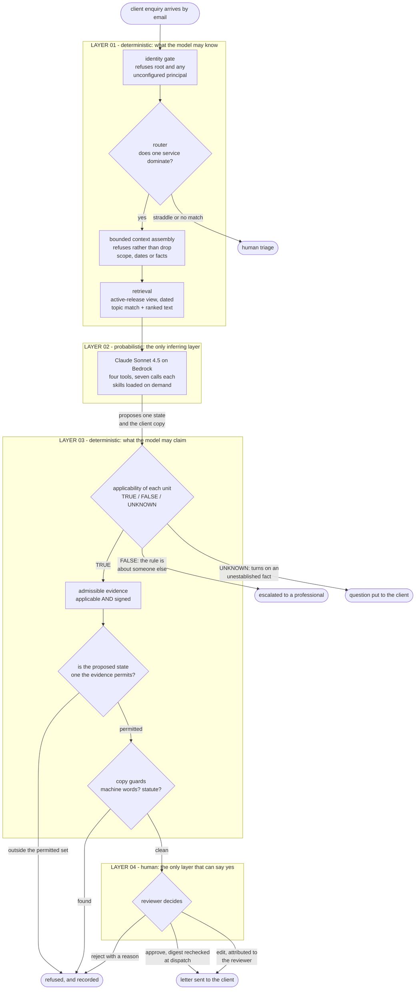

# Architecture

**Models infer. Deterministic systems govern. Humans authorise.**

Anika is a cross-border tax compliance agent for professional-services firms.
Mail arrives, the agent works in the background, and a person is reached only
when the decision is genuinely theirs. One service is in scope:
`nri_india_tax_filing`. Anything outside it is refused honestly and drafted to
a human.

This document describes the control architecture: not what the agent can do,
but what it cannot. Every number and every privilege claim below was read from
the running system, and the ones that are checked by tests say which test.

A rendered version with the same content is at
[the architecture page](https://claude.ai/code/artifact/6843e8db-fc31-4da8-b50f-c633d9f00b9f).

## The failure that set the shape

A probe drove `app/domain/decision.py::evaluate` directly, with no model
anywhere in it. A rule about `RESIDENT` individuals: professionally verified,
on topic, effective on the material date. A client established as a
`NON_RESIDENT`. Every gate unrelated to applicability deliberately satisfied
— routable, in scope, active release, no declared conflict, no missing facts.

The layer permitted `SUPPORTED_WITHIN_POLICY`. It offered that rule as the
basis of the answer. It recorded `requires_professional_verification = false`.
And it gave its reason:

> in scope, material facts confirmed, effective guidance retrieved, no
> declared conflict

Every clause of that sentence was true and the conclusion was wrong.

The reason matters more than the result. This was not a check somebody forgot
to write. `evaluate` read five fields off the case and not one of them was an
attribute of the client, so there was no field in which applicability could be
expressed at all. An auditor reading the rules would have found nothing
missing, because the vocabulary had no word for the thing that was wrong.

That is the failure mode this architecture is built against: not a model that
lies, but a governing system whose language is too small to state the
constraint.

## Four layers, and only one of them infers

Retrieval sits in the middle, where it belongs. It is how the agent finds the
right guidance, never the authority on whether that guidance may be used.



Read it for the edges that do not reach the client. Three of the four
layers can only ever narrow what happens next, and the one that infers
sits in the middle with a deterministic layer on each side: the model
chooses, from a set it did not decide, and writes words a later layer can
refuse. `LAYER 04` is the only place a yes can originate.


### 01 — Deterministic, before: what the model may know

| | |
|---|---|
| identity gate | `app/agent/bedrock.py::enforce_identity`. Refuses an unconfigured or unexpected AWS principal, and refuses the account root outright. There is deliberately no override, because a caller who could switch it off could invoke the model as root. Checked by `AGENT22`. |
| mail ingest | Real Gmail, cursor-tracked in `app.ingestion_cursors`, scoped by `GMAIL_INGEST_QUERY` to what the firm treats as a client enquiry. Run against a live mailbox: one real enquiry ingested, cursor advanced, correlated to a new case. The ingestion scope is deliberately wider than the service scope — FEMA is included so a client writing about remittance reaches the firm and can be honestly escalated, rather than dropped at the mailbox. |
| router | `app/autonomy/router.py`. Keyword dominance, no model: the leading service needs at least two distinct matches and at least twice the nearest rival's. A genuine straddle is refused and reaches a person. |
| context assembly | `app/domain/context.py`. Server-side. Trims free prose only, and refuses rather than drop authorisation, scope, material dates or missing facts to fit a budget. |
| retrieval scope | Two dated queries against `app.active_knowledge_units`, the view the runtime is granted. Topic match, plus ranked full-text capped at twelve. |

### 02 — Probabilistic: the only inferring layer

| | |
|---|---|
| model | Claude Sonnet 4.5 on Bedrock, `us-east-1`. Reads the case, reasons, and drafts the words a client would read. |
| four tools | `get_case_context`, `get_service_knowledge`, `record_proposed_facts`, `propose_next_action`. Each may be called seven times per run before `ToolBudgetHook` stops it. |
| skills on demand | Tax residency, return filing, out-of-scope, loaded through the Strands `AgentSkills` plugin rather than held in every prompt. |
| proposes, never decides | Picks one decision state and writes the copy. Both are proposals until layer 03 accepts them. |

### 03 — Deterministic, after: what the model may claim

| | |
|---|---|
| applicability gate | `app/domain/applicability.py`. Three-valued, evaluated before provenance. A rule about someone else is excluded whatever its pedigree. `APPLY01`-`APPLY14`. |
| verification bar | Only a `PROFESSIONALLY_VERIFIED` unit may be the basis of a supported answer. `AGENT27`. |
| state validator | `decision.validate` raises if the proposed state is outside the permitted set, and the refusal names the ground. `APPLY12`. |
| copy guards | `app/agent/steering.py`. Refuses machine words and statutory citations in a client letter. Proven against the actual defective letter that prompted it. `AGENT25`. |
| digest binding | Approval records `approved_digest`; `app/dispatch/dispatcher.py` recomputes it and refuses on mismatch, so an edited draft cannot ride an old approval. |

### 04 — Human: authorisation

| | |
|---|---|
| approve and send | Nothing reaches a client without it. The agent holds no privilege to write an approval. |
| reject with reason | An `app.approvals` row with `decision = 'REJECTED'` and a `note`, attached to the draft rather than discarded with it. |
| edit, then send | A reviewer's words replace the agent's and are attributed to the reviewer. A trigger checks the signature against the session's own identity, so authorship cannot be laundered. |
| publish knowledge | Only a reviewer can move a candidate onto the verified rung. The agent cannot promote its own findings. |

## The algebra

The deterministic layer does not decide what to do. It decides what may
honestly be claimed, and hands the model a set of permitted states to choose
from. Writing it as sets is how the ordering error that caused the original
failure becomes visible.

```
-- a case c: material date d(c), in-scope topics T(c), enquiry text q(c),
--           and F(c), the facts a human has CONFIRMED. Never proposed facts.

-- two scoped queries, unioned. K^ is the view the runtime is granted:
-- active releases only, which is a privilege boundary, not a filter.
R(c)  =  Rt(c) ∪ Rx(c)

Rt(c) =  { u ∈ K^ : release(u) = rel(c) ∧ effective(u, d(c))
                  ∧ topic(u) ∈ T(c) }

Rx(c) =  top-12 by rank of
         { u ∈ K^ : release(u) = rel(c) ∧ effective(u, d(c))
                  ∧ searchable(u) @@ query(q(c)) },  rank ≥ 0.01

-- the cap is a real term: a rule ranked thirteenth is absent, and
-- absence shows up as a coverage gap, which escalates to a human.

-- applicability is three-valued, and reads only confirmed facts
A(u, c)  ∈  { TRUE, FALSE, UNKNOWN }

-- the evidence an answer may rest on: narrowed to the client, THEN signed
E(c)  =  { u ∈ R(c) : A(u, c) = TRUE ∧ V(u) }

-- coverage is the one place the third value changes the answer
G(c)  =  T(c) \ topics({ u ∈ R(c) : V(u) ∧ A(u, c) ≠ FALSE })

-- blockers
M(c)  =  material predicates not in F(c)
U(c)  =  { p : ∃u ∈ R(c), V(u) ∧ A(u,c) = UNKNOWN ∧ p unresolved }
W(c)  =  { p ∈ F(c) : the vocabulary cannot read F(c)[p] }
X(c)  =  declared conflicts among R(c)

-- a retrieval or context failure is not a knowledge gap, and outranks
-- every term below it
failure(c)  ⇒  S(c) = { SYSTEM_FAILURE }

SUPPORTED ∈ S(c)  ⟺  G(c) = ∅  ∧  M(c) ∪ U(c) = ∅  ∧  W(c) = ∅
                     ∧  X(c) = ∅  ∧  routable(c)  ∧  declined(c) = ∅

cite(SUPPORTED)  =  E(c)      -- so applicability is upstream of every citation

-- the model proposes; the server refuses anything outside the set
s* ∈ S(c)   else   DecisionRefused(s*, S(c), rationale)
```

Four things in that are load-bearing and easy to get wrong:

- **`A` before `V`, not `V` before `A`.** As filters they commute, so the order
  looks cosmetic. It is not: the coverage term reads the applicability verdict,
  and no ordering of verification recovers it.
- **`≠ FALSE`, not `= TRUE`** in the coverage term. Coverage counts a unit whose
  applicability is merely unknown. Counting only `TRUE` would report a corpus
  gap where the corpus is fine and a fact is missing.
- **`U(c)` is drawn from verified units only.** Unsigned material can never be
  the basis of an answer, so it must never become the reason a client is asked
  for something.
- **`W(c)` never enters `M(c)`.** A question already answered is never asked
  twice. An answer we cannot read is our defect, so it escalates.

## Why three values

A boolean has to fold `UNKNOWN` into one of the others and both choices are
wrong.

Treat it as `TRUE` and a rule that may not apply becomes the basis of an answer
— the original failure, with extra steps. Treat it as `FALSE` and the evidence
disappears silently: if residency is unestablished, dropping every
resident-rule conceals the fact that residency is precisely what needs
establishing, and the case goes to a professional labelled "we hold nothing on
this", which is untrue.

The third value routes to `MISSING_FACTS` and names the predicate, so the
system asks the question instead of quietly narrowing its own evidence. The
answer becomes "I cannot tell you whether this applies until we know X", which
is both true and useful.

A rule may restrict on more than one attribute. Contradiction dominates, as in
strong Kleene:

| ∧ | T | F | U |
|---|---|---|---|
| **T** | T | F | U |
| **F** | F | F | F |
| **U** | U | F | U |

Without the bottom-middle cell the agent would ask a client for their
citizenship in order to settle a question already settled. `APPLY13`.

## Retrieval, contained

Retrieval widened from exact topic matching to ranked text search, which
correctly brings unsigned and inapplicable material into the candidate pool.
Handing that pool over as one array with a status field on each row makes the
status a convention. `get_service_knowledge` returns four buckets instead, and
every unit lands in exactly one of them, because a model reading the same
statement twice under two different instructions will follow whichever it read
last.

| Bucket | Rule |
|---|---|
| `units` | **May be relied on.** Verified and applicable to this client. The only bucket a supported answer can cite, and the server enforces that independently. |
| `applicability_unknown` | **Verified, but not yet yours.** Carries the predicates that would settle it, so the agent asks for those rather than reasoning past them. |
| `consulted_unverified` | **Exists, unsigned.** Shown so the agent can honestly say a source exists and no professional has signed it — often the only true answer available. |
| `not_applicable` | **About someone else.** True, possibly signed, and nothing to do with this enquiry. Shown only so the agent does not report that nothing was found. |

## Separation of powers

A rule enforced in application code holds for the queries somebody remembered
to route through it. A privilege holds for every query the role can ever make.
So the agent and the reviewer are different database roles with different
grants, most of them issued column by column — which means
`has_table_privilege` reports the wrong answer here and
`has_any_column_privilege` is the honest test. It says `SELECT` only on
`app.cases` for the runtime, which can in fact update six named columns.

Everything below was read from the live catalogue, not from the migration that
was supposed to create it.

| Object | Agent runtime role | Reviewer role | What that enforces |
|---|---|---|---|
| `knowledge_units` | **no privilege at all** | select, insert | The agent cannot reach unapproved knowledge by any query. Only a reviewer publishes. |
| `active_knowledge_units` | select | select | A view restricted to active releases. This, not a `WHERE` clause, is what the runtime sees. |
| `approvals` | select | select, insert, update → `revoked_at`, `revoked_reason` | The agent cannot approve its own work. An approval can be revoked but never edited. |
| `action_proposals` | select, insert, update → `current_revision`, `updated_at` | select | A reviewer cannot author the agent's proposal, so authorship cannot be laundered. |
| `proposal_revisions` | select, insert | select | Append-only. A revision cannot be rewritten after it was reasoned about. |
| `case_facts` | select, insert | **select only** | The agent can propose a fact and can never alter one — but no human can confirm one either. See the open list below. |
| *the third role* | `agents_admin` owns every object | | Stated because leaving it out would overclaim. Migrations, bootstrap and test fixtures run as the owner; nothing at request time does. The separation holds between the two roles that serve traffic, and rests on the owner's credentials never being the ones the application carries. |
| *every table* | **no delete** | **no delete** | Zero `DELETE` grants exist in the schema, and no `TRUNCATE`, `TRIGGER` or `REFERENCES` grants either. Neither role can destroy a record, including its own. |

No function in the `app` schema is `SECURITY DEFINER`, so none of this can be
walked around by calling something that runs as the owner. That was not free:
an earlier migration used `SECURITY DEFINER` and thereby defeated its own
authorship trigger, because `current_user` became the function owner rather
than the caller. Migration 013 removed it and switched to `session_user`.

## The verification ladder

Status is not a label a process can set. Each rung above the first carries a
constraint that cannot be satisfied by editing the status column, which is what
makes the ladder worth anything.

| | Rung | What the schema requires |
|---|---|---|
| 01 | `UNVERIFIED` | Retrievable, never citable. Where a model-extracted candidate starts. |
| 02 | `SOURCE_RECORDED` | A non-empty source locator, which is `NOT NULL` and constrained. Nobody has checked the statement against it. |
| 03 | `SOURCE_VERIFIED` | Additionally the captured passage, its digest and a capture time — the evidence a reviewer would need to check the claim themselves. |
| 04 | `PROFESSIONALLY_VERIFIED` | Additionally the reviewer who signed it and when, with a trigger checking the signature against the session's own identity. **Only this rung may support an answer.** |

Three attempts at one test fixture were refused by these constraints before one
was accepted. The refusals were right and the test was wrong each time.

## What is proven, and what is merely built

A safe result produced by a well-behaved model is not evidence of a safe
architecture. A safe result produced while the model is assumed to be wrong is.

**Established**

- **171 checks, eleven suites, from nothing.** `scripts/verify_clean_slate.py`
  builds a throwaway container from the repository alone, runs every check
  against it, and destroys it.
- **The applicability gate is load-bearing.** With `applicability.assess`
  replaced at runtime by the behaviour the code had before applicability
  existed, five checks fail — including every one that exists because of the
  original defect. A check that would pass without the fix defends nothing.
- **The restriction survives the database.** `AGENT28` reads a stored
  restriction back through both retrieval paths, which have different select
  lists and different row offsets, and requires it to exclude for a
  non-resident and not exclude for a resident. Exclusion that happens either
  way proves nothing.
- **The server refuses, it does not advise.** A model proposing a supported
  answer on inapplicable evidence raises, and the refusal names the ground.
- **Neither role can delete anything.** Read from the catalogue.
- **The router refused a real ambiguous enquiry rather than guessing.** A
  live email arrived with the subject `Fema` and a body asking about tax in
  India as an NRI — one keyword matching each of two services. Neither
  reached the two-match threshold and neither dominated, so the router
  recorded `AMBIGUOUS  no dominant service across 2 candidates, a human must
  choose`, named which keyword matched which service, and left the case
  without a scope. Migration 009 forbids acquiring a service scope
  anonymously, so the case waits for a person instead of being guessed at.
  This is the behaviour the dominance rule exists for, observed on live input
  rather than a fixture.

**Open, and known**

- **The gate excludes on real rows; the live corpus is still untagged.**
  `AGENT29` drives context assembly, retrieval and the decision layer against
  real rows with a reviewer-confirmed fact, and a verified rule about residents
  is excluded from a confirmed non-resident's case with the ground recorded. So
  the `FALSE` branch is demonstrated, not merely tested in isolation. But all
  twelve units in the live corpus still carry no restriction, so on today's data
  every unit applies to everyone. What is missing is reviewer tagging at
  sign-off, not the mechanism.
- **A reviewer can now confirm a fact — through the database only.**
  Migration 021 grants `agents_reviewer` column-level `INSERT` on
  `app.case_facts`, and confirmation is an append rather than an edit, so the
  agent's proposal survives as evidence beside the human's confirmation.
  `AUTH22` proves the reviewer can append a `CONFIRMED` row and cannot rewrite
  it afterwards; `AGENT29` proves the confirmed fact reaches the decision layer.
  Before this, zero of twenty-six fact rows had ever been confirmed and
  `SUPPORTED_WITHIN_POLICY` was unreachable on any input rather than merely
  unobserved. **The console route does not exist yet**, so a reviewer cannot do
  this from the interface: the capability is real, the interface is not.
- **The applicability field means less than tax applicability, and the
  code reads it as meaning more.** Traced: `A(u,c)=TRUE` and `V(u)` put a
  unit into `usable`, which becomes `approved_unit_ids`, which is what
  `citations_for(SUPPORTED_WITHIN_POLICY)` returns. So a `TRUE` verdict makes
  a rule a **recorded basis** for a supported answer — sufficiency
  semantics, not a necessary-condition filter. A professional review of the
  five signed units refused to tag the deemed-residency rule for exactly this
  reason: Indian citizenship is necessary but not sufficient. Under the
  Income-tax Act 2025 that rule also requires total income above
  ₹15 lakh excluding foreign-source income, non-liability to tax
  elsewhere by domicile or residence, and non-residence under the ordinary
  tests. Encoding `citizenship = INDIAN` alone would state a compound legal
  rule as though one predicate settled it. **The rule is deliberately
  untagged** pending a decision on how compound predicates are represented.
  Note the asymmetry: `FALSE` (exclusion) and `UNKNOWN` (asking for the
  fact) are both sound as necessary-condition behaviour. Only `TRUE`
  overclaims.
- **Signed rules are dated by publication, not by statutory force.** All
  five professionally verified units carry `effective_from = 2026-09-11`,
  the day they were published, because `accept_and_publish` hardcodes
  `current_date`. Retrieval filters `effective_from <= material_date`, so
  this decides which body of law is reachable.
- **`material_date` is the enquiry date, not the tax year in question.** It
  is derived from `enquiry.received_at`. A client asking about FY 2025-26
  is answered from rules in force on the day their email arrived. The
  Income-tax Act 2025 governs tax years beginning on or after 1 April 2026
  while FY 2025-26 falls under the 1961 Act, so those are different bodies
  of law. The temporal mechanism exists and is wired to the wrong two
  dates; this is a mis-wiring, not a missing feature, and it is arguably
  more consequential than adding a further demographic dimension.
- **Two signed units have not had a content-completeness review.** The
  basic residency test and the RNOR test are correct as far as they go and
  appear to omit statutory alternatives — the 120-day limb for visiting
  Indian citizens and persons of Indian origin above the income threshold,
  the employment and crew exceptions, and the additional RNOR routes
  including deemed residents. This is a question about the content of the
  knowledge, not about its applicability tagging, and it must not be
  silently fixed while deciding tagging. A fact can be legally correct
  while a conclusion drawn from it is still incomplete.
- **Two dimensions, exact match.** Residency and citizenship are the corridor
  this build demonstrates. Treaty country, income type and age have no
  expression at all. The vocabulary matches whole normalised strings and
  escalates rather than guessing, because "non-resident" contains "resident"
  and a system that guessed would answer from the wrong half of the law.
- **The unit is the wrong atom, in two of five cases.** One signed unit states
  three separate rules in one sentence: arrival and departure both count, the
  year runs April to March, and an hour after immigration is a full day. Citing
  it cites all three. The other three signed units are single tests with
  disjunctive limbs, which is not the same defect, so the fix is narrower than
  splitting everything.
- **The validator and the tool can be judging different units.** Both call
  the same `assess`, so they cannot disagree about what applicability means, and
  both are scoped to the same release, in-scope topics and material date. But
  the tool retrieves with the query string the model chose while the decision
  layer retrieves with the client's own words, so the ranked text arms can
  differ and neither set contains the other. Seeing fewer units makes the
  validator block on a coverage gap, which is safe. Seeing more lets it cite a
  verified, applicable, on-topic unit the model never read — nothing unsafe
  reaches the client, but the record would name a basis that did not inform the
  letter. The fix is to make the validator's set a superset by construction:
  retrieve with the client's words *and* with every query the model actually
  used, which is already recorded in `app.agent_tool_calls`.
- **Clean slate is not reproducibility.** It proves no hand-built cluster state
  is needed. It does not prove a build from a named commit, because it runs the
  working tree.

## Verify it yourself

```
# build a throwaway database from this repository, run all 171 checks,
# destroy it. The primary instance is never touched.
.venv/Scripts/python.exe scripts/verify_clean_slate.py

# the applicability gate alone: no model, no database, fourteen checks
.venv/Scripts/python.exe tests/applicability_smoke.py
```

On macOS or Linux the interpreter is `.venv/bin/python`. The project
interpreter matters: a bare `python` has no `psycopg` and exits with
`ModuleNotFoundError` before reaching a single check.

`docs/BUILD_STATE.md` is the operational log and the single source of truth for
what is built. Where it and this document disagree about state, BUILD_STATE is
newer.
