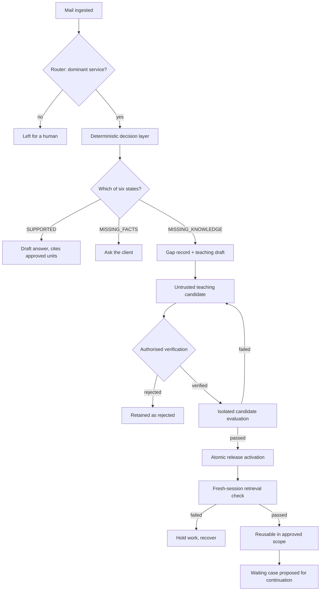

# Engineering plan

Authored 2026-09-12. Submission closes **2026-09-14 17:00 PDT**
(2026-09-15 05:30 IST). Roughly **58 working hours**, solo.

This document is the control surface for the rest of the build. Nothing
gets built that is not a numbered task under a sprint below, and no
sprint closes on anything other than its stated evidence.

---

## 0. Why this document exists

The build has been running without exit criteria. Work was picked by
whatever was most recently discussed, and "done" meant the test suite
went green.

That produced a specific, measurable failure. Sprint A was reported
complete on the strength of `AUTH22` passing. `AUTH22` writes a
`CONFIRMED` fact, proves a reviewer may write it, and then deletes it in
its own cleanup phase. The live database today reads:

```
app.case_facts        26 rows   26 PROPOSED   0 CONFIRMED
app.knowledge_units   12 rows   0 tagged for applicability
app.proposal_revisions 8 rows   SUPPORTED_WITHIN_POLICY: 0, ever
```

So the capability was real, the report was wrong, and the agent still
cannot produce a supported answer on any input. A suite of negative
controls passes perfectly while the capability is absent — the same
shape the forensic audit found one layer down, repeated one layer up.

The corrective is not more testing. It is that **a sprint closes on
durable state, never on test output.**

---

## 1. Method

Requirements traceability with evidence-gated increments. Three rules,
no ceremony beyond them.

**1.1 Every requirement has a number and a source.** Requirements come
from two places only: the engineering contract at
`Coding_Engineer_Instruction_Verified_Learning_Loop.md` (cited as §n)
and the published judging criteria (cited as JC-n). Anything not
traceable to one of those is not a requirement, it is an idea, and ideas
go to §7.

**1.2 Every requirement maps to a component and a check.** If a
requirement has no named check it is `PLANNED`, regardless of how much
code exists. If a check exists but nothing durable uses it, the
requirement is `PARTIAL`. This distinction is the whole point of §0.

**1.3 Status vocabulary is fixed** by contract §10 and used strictly:

| Status | Means |
|---|---|
| `DEMONSTRATED` | A durable artifact exists that a third party can inspect after the process exits. |
| `PARTIAL` | The mechanism exists and is exercised, but not on real data or not end to end. |
| `BLOCKED` | Cannot proceed; the blocker is named and owned. |
| `PLANNED` | Not built. |

Nothing is `DEMONSTRATED` on the strength of a passing test.

---

## 2. Definition of done

One rule, applied to every task in every sprint.

> **A task is done when a durable artifact outside the test process
> proves it, and the artifact is named in advance.**

Durable means: a row still present in the live database after the suite
exits, a file written to `docs/evidence/`, or a screen a person can open
and read. A passing check is necessary and never sufficient.

Each task below therefore carries an **Evidence** line written *before*
the work starts. If the evidence cannot be stated in advance, the task
is not specified well enough to begin.

**Corollary that bit us:** any check with a cleanup phase that removes
its own rows can never be a task's evidence. Such checks prove
permissions. They do not prove outcomes.

---

## 3. Target architecture

Unchanged in its four layers. What changes is that the learning loop
becomes a first-class part of it rather than an implication.

```
Models infer.  Deterministic systems govern.  Humans authorise.
```

| Layer | Decides | Status |
|---|---|---|
| Deterministic, before | what the model is allowed to know | `DEMONSTRATED` |
| Probabilistic | the only inferring layer | `BLOCKED` (§5.1) |
| Deterministic, after | what the model is allowed to claim | `DEMONSTRATED` |
| Human | the only layer that can say yes | `PARTIAL` |

### 3.1 The loop the contract requires



Everything from `M` to `S` exists and runs. Everything from `G` onward
is the gap: `G` has no table, and `E`, `K` and `W` do not exist.

### 3.2 Components, and the honest state of each

| Component | Module | Status |
|---|---|---|
| Mail ingestion, cursor-tracked | `app/integrations/gmail_ingest.py` | `DEMONSTRATED` — real cursor `1789228115`, real sender |
| Deterministic router | `app/autonomy/router.py` | `DEMONSTRATED` — refused a real ambiguous enquiry |
| Retrieval over an active release | `app/agent/bedrock.py` tools | `PARTIAL` — runs, but no real answer has ever cleared it |
| Six-state decision layer | `app/domain/decision.py` | `PARTIAL` — 3 of 6 states observed, `SUPPORTED` unreachable |
| Three-valued applicability | `app/domain/applicability.py` | `PARTIAL` — fires on real rows, corpus 0/12 tagged |
| Separation of powers | migrations 001–022 | `DEMONSTRATED` — column grants, zero `DELETE` anywhere |
| Provider adapter | `app/agent/model_provider.py` | `PARTIAL` — refuses correctly, has never answered |
| **Gap record + teaching draft** | — | **`PLANNED`** — no table exists |
| Candidate → verification | `app/training/store.py` | `PARTIAL` — 12 candidates, no digest binding |
| Candidate evaluation gate | `app/evals/runner.py` | `BLOCKED` — last runs scored 6/8 and 5/8, no credentials |
| Atomic publication + jobs | — | `PLANNED` — no jobs table |
| Reuse check after restart | — | `PLANNED` |
| Reviewer console | `app/reviewer/server.py` | `PARTIAL` — 3 surfaces work, 1 is a stub, 2 actions have grants and no route |
| Guarded dispatch | `app/dispatch/` | `PARTIAL` — digest-bound, one simulated send |

---

## 4. Requirements traceability

The matrix. A requirement with no check id is not started, whatever code
exists near it.

| ID | Source | Requirement | Component | Check | Status |
|---|---|---|---|---|---|
| R1 | §2 | Six reason codes, multiple per request, original message preserved | `decision.py` | `APPLY01-14` | `PARTIAL` |
| R2 | §3 | Gap persisted with case, reason codes, release consulted, retrieved units, missing predicates, reviewer | — | — | `PLANNED` |
| R3 | §3 | Teaching draft generated from stored case, no invented placeholders | — | — | `PLANNED` |
| R4 | §3 | Gap retries deduplicated, unrelated cases never merged | — | — | `PLANNED` |
| R5 | §4 | Case response and reusable lesson are separate reviewer decisions | console | `VIEW01-12` | `PARTIAL` |
| R6 | §4 | Reviewer may confirm a fact | mig. 021 | `AUTH22` | `PARTIAL` — grant only |
| R7 | §4 | Reviewer may scope a lesson, not rewrite it | mig. 022 | `AUTH24` | `PARTIAL` — grant only |
| R8 | §5 | Unit carries verification status, verifier, content digest | `knowledge_units` | `AGENT28` | `PARTIAL` |
| R9 | §5 | Verification bound to candidate digest and base release | — | — | `PLANNED` |
| R10 | §5 | Candidate evaluated in isolation before activation | `evals/runner.py` | — | `BLOCKED` |
| R11 | §5 | Activation atomic with continuation jobs | — | — | `PLANNED` |
| R12 | §5 | Dates distinguish source update, legal commencement, case event | `knowledge_units` | — | `PLANNED` — two known defects |
| R13 | §6 | Retrieval by approved release, scope, case dates and facts | agent tools | `AGENT*` | `PARTIAL` |
| R14 | §6 | A later equivalent enquiry reuses the lesson, no re-teaching | — | — | `PLANNED` |
| R15 | §7 | Four bounded tools, authority boundaries enforced | `bedrock.py`, `hooks.py` | `AGENT*` | `DEMONSTRATED` |
| R16 | §7 | Approval bound to complete message and evidence | `approvals` | `APPROVE01-21` | `DEMONSTRATED` |
| R17 | §8 | L01–L16 behaviour tests | — | — | see 4.1 |
| R18 | §10 | Honest capability ledger with the four statuses | `BUILD_STATE.md` | `ENV08` | `PARTIAL` |
| R19 | JC-1 | Strands used thoroughly and non-trivially | `app/agent/` | `156 checks` | `DEMONSTRATED` — 5 of 7 primitives |
| R20 | JC-2 | Complete, coherent product experience | console | `VIEW*` | `PARTIAL` |
| R21 | JC-3 | Credible case, addressed *as demonstrated* | — | — | `BLOCKED` on R10 |
| R22 | JC-5 | Video shows it working end to end | — | — | `PLANNED` |

### 4.1 Acceptance tests L01–L16

Contract §8. I have **not** audited which existing checks satisfy
these, so every row is marked honestly as unmapped rather than claimed.
Mapping them is task **S1.0** and is the first thing that happens.

| Priority | Tests | Why this tier |
|---|---|---|
| Must (loop is the claim) | L01, L02, L05, L10, L11 | These are the final claim in §10. Without them the entry has no learning loop. |
| Must (safety is the pitch) | L04, L06, L07 | Authority and digest binding. Likely partly covered by `AUTH*`; needs audit. |
| Should | L03, L12, L13, L14 | Operational honesty and privacy. `L13` may already hold via case binding. |
| Could | L08, L09, L15, L16 | Crash, race and retry semantics. Real, and cuttable under §9. |

---

## 5. Baseline and blockers

### 5.1 BLOCKER-1: no model access

`aws sts get-caller-identity` returns `ExpiredToken` for profile
`afh-workshop` (account `591893241838`, `WSParticipantRole`). Project
account `985016029094` is in AISPL verification.

Consequence: R10, R21 and R22 cannot proceed, and no agent run can be
recorded. **This blocks three of the five judging criteria.**

Decision already taken: the rules require Strands, not Bedrock, so the
provider is configuration. The adapter is built and verified.

**Owner: AK.** Unblocked by one `ANTHROPIC_API_KEY` in `.env`.
Everything in Sprint 1 proceeds without it; Sprint 2 onward does not.

### 5.2 BLOCKER-2: uncommitted work

Twelve files of verified adapter work are uncommitted, and six commits
are unpushed. **Owner: AK**, one approval.

### 5.3 Recorded defects, not blockers

| # | Defect | Evidence |
|---|---|---|
| D1 | `effective_from` is the publication date, not legal commencement | `accept_and_publish` hardcodes `current_date` |
| D2 | `material_date` is the enquiry date, not the tax year | R12 |
| D3 | Ingestion filter recall 4/14 = 28% | Gmail does not stem; `filing` ≠ `file` |
| D4 | Conflict is declared, never detected | `knowledge_unit_conflicts` = 0 rows |
| D5 | `/knowledge` renders "Not built yet." in the primary nav | live HTTP |
| D6 | Dead `titles` entries for routes that no longer reach them | `server.py:664` |

---

## 6. Sprints

Five sprints, each with entry and exit criteria. **A sprint that misses
its exit criteria is not closed and not reported as closed.**

---

### Sprint 0 — Freeze the baseline · 1h · no new capability

**Entry:** this plan approved.

| # | Task | Evidence |
|---|---|---|
| S0.1 | Commit the provider adapter | commit sha, `git status` clean |
| S0.2 | Rewrite `BUILD_STATE.md` against measured state, using the four statuses | the file, matching §3.2 and §5 |
| S0.3 | Map L01–L16 to existing checks; record the unmapped ones | a table in `BUILD_STATE.md` |

**Exit:** working tree clean; `BUILD_STATE.md` contains no claim not
supported by a queried row or a named check.

**Explicitly not in this sprint:** any new feature.

---

### Sprint 1 — Make the agent able to finish · ~10h · no model needed

The highest-value sprint in the plan, and it runs while BLOCKER-1 is
open. Target: **`SUPPORTED_WITHIN_POLICY` becomes reachable on a real
case for the first time.**

| # | Task | Requirement | Evidence |
|---|---|---|---|
| S1.1 | Migration: `app.knowledge_gaps` with case, reason codes, release consulted, retrieved units, missing predicates, reviewer | R2 | migration applied; table in `pg_stat_user_tables` |
| S1.2 | Gap written from a validated proposed action, deduplicated on retry | R2, R4 | ≥1 real gap row surviving the suite |
| S1.3 | Teaching draft rendered from the stored gap, every placeholder resolved or explicitly unknown | R3 | the rendered draft in `docs/evidence/` |
| S1.4 | Console route: confirm a fact | R6 | `case_facts` shows `CONFIRMED ≥ 1` on a real case, after restart |
| S1.5 | Console route: tag a rule's applicability | R7 | `knowledge_units` shows ≥1 tagged unit, durably |
| S1.6 | Console surface: **Requests** tab | R5, R20 | screenshot, and the gap readable on screen |
| S1.7 | Fix D3 — ingestion recall, measured before and after | D3 | recall figure on the same 14-subject sample |

**Exit, all four required:**
1. `SELECT count(*) FROM app.case_facts WHERE status='CONFIRMED'` > 0
   in the live database after the suite has exited.
2. At least one `proposal_revisions` row with
   `decision_state = 'SUPPORTED_WITHIN_POLICY'`.
3. At least one `knowledge_gaps` row with a rendered teaching draft.
4. Clean-slate run green, total updated in all three documents.

---

### Sprint 2 — Close the teaching loop · ~12h · needs BLOCKER-1 cleared

| # | Task | Requirement | Evidence |
|---|---|---|---|
| S2.1 | Bind verification to candidate digest + base release; an edit invalidates it | R9 | check: edited candidate cannot inherit green status (L07) |
| S2.2 | Evaluation gate: candidate evaluated in isolation, production retrieval has no include-unapproved flag | R10 | eval run row with candidate id, score, and prompt digest |
| S2.3 | Atomic activation + continuation jobs in one transaction | R11 | jobs row; partial failure leaves no active release |
| S2.4 | Post-activation retrieval check as a recoverable job | R11 | check passes; affected work stays blocked until it does |
| S2.5 | Publication states on the Learning surface, derived from events | §5 | screenshot showing all six states |

**Exit:** one lesson goes gap → candidate → verified → evaluated →
published → retrieval-checked, with every state read from stored events,
and the eval score recorded. L01, L05, L06, L07 pass.

---

### Sprint 3 — Prove reuse · ~8h · needs Sprint 2

The contract's final claim lives here.

| # | Task | Requirement | Evidence |
|---|---|---|---|
| S3.1 | Fresh process, cleared history, independently supplied facts; unit retrieved from durable storage | R14, L10 | transcript naming unit id, version, release |
| S3.2 | Differently worded equivalent question reuses the lesson, raises no duplicate teaching request | R14, L11 | two runs, one gap |
| S3.3 | Similar wording, different material facts: previous conclusion **not** copied, applicability checked | L12 | refusal with the applicability reason |
| S3.4 | Revoked lesson cannot authorise a dispatch from cache | L14 | refusal at dispatch |

**Exit:** the §10 claim is true and its evidence is in
`docs/evidence/` — *the agent detected insufficient approved guidance,
obtained a verified human correction, saved it durably and appropriately
reused it later within its approved scope.*

---

### Sprint 4 — Presentation · ~8h

| # | Task | Requirement | Evidence |
|---|---|---|---|
| S4.1 | Build the `/knowledge` surface: verification ladder, applicability tags | D5, R20 | screenshot; no "Not built yet." anywhere |
| S4.2 | Remove D6 dead code | D6 | diff |
| S4.3 | Golden path recorded end to end | R22 | the recording |
| S4.4 | Video ≤ 5 min, public, YouTube or Vimeo | R22, JC-5 | the URL |
| S4.5 | Devpost gallery, ≤15 images at 3:2 | JC-5 | the images |
| S4.6 | Submit | — | submission confirmation |

**Exit:** submitted, with a video that shows the Sprint 3 evidence
happening rather than described.

---

### Sprint 5 — Only if Sprints 1–4 close early

`SessionManager` (6 of 7 Strands primitives), AgentCore deployment if
AWS returns, D1/D2 temporal defects, D4 conflict detection, builder.aws
post.

---

## 7. Explicitly out of scope

Contract §9 names what to cut under time pressure, and this is that
list, adopted verbatim rather than re-argued:

- automatic candidate generalisation — reviewer enters the lesson
- a publication dashboard beyond the six states
- semantic search or vector retrieval — bounded text search over a small
  corpus, until measured misses justify otherwise
- additional agents, another orchestration SDK, a graph database
- a second service — `nri_india_tax_filing` only

And not cuttable, per the same section: durable persistence, publication
authorisation, the reuse proof, honest status reporting.

Ideas that are not requirements and will not be built: anything not
traceable to a §ID or JC-ID in section 4.

---

## 8. Risks

| Risk | Effect | Mitigation |
|---|---|---|
| BLOCKER-1 persists | Sprints 2–4 cannot start; three criteria unscored | Sprint 1 is deliberately model-free; adapter already refuses honestly rather than faking |
| Sprint 2 overruns | No reuse proof, so no §10 claim | S2.1–S2.4 are the floor; S2.5 is cuttable to a table |
| Scope creep via defects | D1–D6 consume sprint time | D1, D2, D4 are Sprint 5; only D3, D5, D6 are scheduled |
| Another false completion report | Loss of trust, wrong decisions | §2, enforced by querying live state in the closing report of every sprint |

---

## 9. QC of this plan

Contract §11 asks these of any instruction, so they are asked of this
one.

**What was assumed?** That ~58 hours is real working time, which it is
not — it includes sleep. That BLOCKER-1 clears within Sprint 1. That the
L01–L16 audit in S0.3 will find partial coverage rather than none; if it
finds none, Sprint 2 grows and Sprint 4 must shrink.

**What was missed previously?** That "done" was never defined, so every
report was free to mean whatever the last green run suggested. Also that
a test with a cleanup phase cannot be evidence — the single mechanical
cause of the Sprint A misreport.

**What looks right but is not enough?** The 156 passing checks. They
prove the deterministic layer refuses correctly. They do not prove the
agent can complete a piece of work, and until Sprint 1 closes, it
cannot.

**What would I be defending?** The behaviour of a named commit on
specified cases, with every human action disclosed. Not uncertainty
detection, not accuracy, and nothing whose only evidence is a test that
deleted its own rows.
